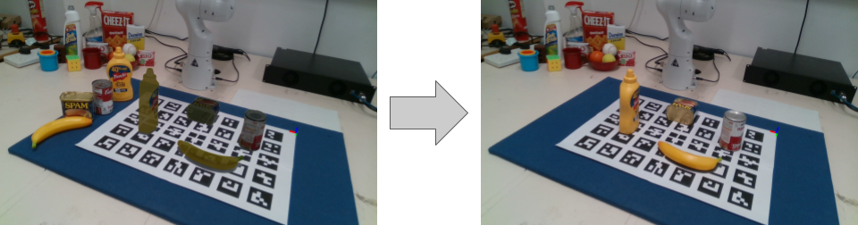
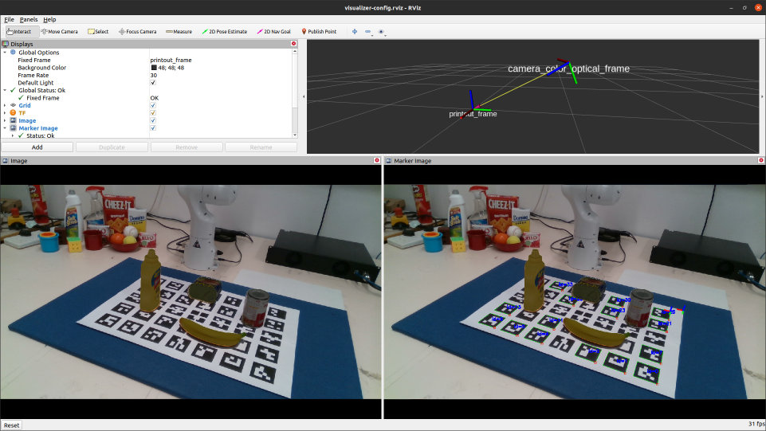

# BURG Scene Visualizer

This is a ROS package for visualizing scenes from the [BURG SetupTool](https://github.com/markus-suchi/burg-setuptool).
The printed marker templates will be recognized and the objects are projected
into the image to facilitate placing the real objects.



### installation

You need to install the [BURG-Toolkit](https://github.com/mrudorfer/burg-toolkit) so that it is found by the Python 
that ROS uses. This is usually the system python.
Then you can simply clone this repository into your `catkin_ws/src` and install 
using `catkin_make`.

### usage

The package contains:
- `nodes/visualize_scene.py` The actual node with the SceneVisualizer.
- `launch/visualize.launch` A launch file for exemplary setup with a realsense or kinect2 camera,
    including visualization in rviz.

In any case, you will have to provide at least the `scene_fn` argument, which points to
a scene.yaml file that was created with
[BURG SetupTool](https://github.com/markus-suchi/burg-setuptool)
or 
[BURG-Toolkit](https://github.com/mrudorfer/burg-toolkit).
Refer to those repos for more details on scene creation.

E.g. `roslaunch burg_scene_visualizer visualize.launch scene_fn:=/path/to/your/scene.yaml` 
should give you something like this:




Note that scenes can be stored without a printout and such scenes will not work. You can check
by opening the yaml file with an editor and if there is a line `printout: null` then it does not contain any
information about the printout. You can easily add this using the BURG toolkit with:

```
import burg_toolkit as burg

scene, lib, _ = burg.Scene.from_yaml(yaml_fn)
printout = burg.printout.Printout(size=scene.ground_area)
scene.to_yaml(yaml_fn, object_library=lib, printout=printout)
```
